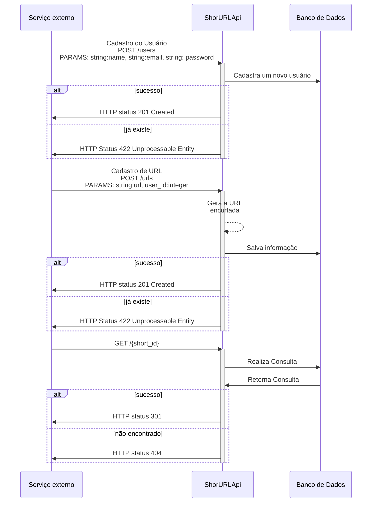

# Objetivo

Neste aquivo (rascunho) encontra-se como foi a trajetória do desenvolvimento do projeto ShortURL, buscando explicar o mais passo a passo possível e os desafios/problemas que encontrei.

#

# Por que um encurtador de URL?
Em uma entrevista tive a oportunidade em um _live code_ realizar um _System Desing_, onde o projeto era um encurtador de URL contendo alguns _cases_ em específico.

Nunca tinha trabalhado com um encurtador, foi um desafio interessante. Após isso, resolvi desenvolver ele, inciando com o planejamento até um possível deploy, deixando como portifólio.

Deixando claro que, no meu interesse de aprendizado:
- A ideia é criar a parte de backend, ou seja, não terei tela, apenas rotas;
- Utilizar Elixir, uma linguagem que tenho mais afinidade;
- Explorar um pouco mais de arquitetura, adicionando Docker, CI e Arquiteura Limpa;
- Evoluindo aos poucos, sem precisar deixar o projeto 100% funcional.

# Primeiros passos: planejando o projeto

A ideia é simples: criar uma API onde um serviço externo consiga enviar uma URL e tenha como retorno uma abreviada.

Com umas ideia simples, pensei em apenas uma rota de cadastro onde teria a nova url, e acessando essa url, simplesmente redirecionar para a url cadastrada.
Resolvi então adicionar a opção ter o cadastro de usuário, onde ele consiga ver todas as URLs que ele já adicionou, tendo em vista uma opção de analise de quantos clicks teve a url (versão ainda não aplicada no projeto)

Em uma fluxo simples (usuário cadastra, depois cria a URL e pode acessar ela), teria o seguinte fluxo:



# Pensando sobre as rotas

Com ideia do fluxo, pensei nas principais rotas para ser valor.

| route     	| HTTP verb 	| Descrição                          	| Parâmetros           	|                  	|
|-----------	|-----------	|------------------------------------	|----------------------	|------------------	|
| /users    	| POST      	| criação do usuário                 	| nome, email e senha  	| id, nome e email 	|
| /users/id 	| PATH      	| atualização do dados do usuário    	| nome, email ou senha 	| id, nome e email 	|
| /users/id 	| DELETE      	| deleta o usuário    	| id 	|  	|
| /urls 	| POST      	| criação de uma URL encurtada    	| url, user_id 	| id, short_url, url, code_url 	|
| /code_url 	| GET      	| acesso a url    	| code_url 	| redireciona nova página 	|

Após isso, pensei em outras rotas para melhorar a experiência

| route     	| HTTP verb 	| Descrição                          	| Parâmetros           	|                  	|
|-----------	|-----------	|------------------------------------	|----------------------	|------------------	|
| /users/id    	| GET      	| dados do usuário e urls já cadastradas                 	| id do usuário  	| id, nome, email, lista de urls cadastradas 	|
| /urls/id 	| GET      	| informação de uma URL específica    	| id da url 	| id, short_url, url, code_url 	|
| /urls/id 	| DELETE      	| deleta a url cadastrada    	| id da url 	|  	|

# Lógica do encurtador

Nesse ponto pensei em várias estruturas, como a ideia de mais um campo na tabela urls contendo o resultado gerado a partir de um uuid com tamanho reduzido.

Pesquisei para ver exemplos e estudos de casos, procurando algo de interesse que serveria de ponto de partida. Encontrei o projeto [Shorten Api Tutorial](https://github.com/bnchrch/shorten_api_tutorial) onde possui um bom exemplo, mas resolvi simplificar mais ainda.

Escolhi então o seguinte fluxo: ao cadastrar uma URL, utilizaria o próprio id do banco e codificaria ele na base64. Quando acessar a url (algo como, short_url.com/codigo), decodificaria o código e teria o id do banco para consulta.

Essa opção atendia minha demanda e não exigia grande desenvolvimento, mas é claro que possui falhas, como ter facil reconhecimento do que seria o ID no banco e com o crescimento da tabela, esse código acabaria tendo um tamanho maior.

# Iniciando o projeto Phoenix e seu CRUD

Iniciei sem utilizar o Docker, instando as dependencias com a ferramenta [asdf](https://github.com/asdf-vm/asdf) (mais para frente explico como e o motivo). Logo em seguida, resolvi criar o projeto com o seguintes parâmetros:

```bash
mix phx.new short_url --app short_url --no-html --no-assets --no-gettext --no-mailer
```
Sobre a configuração:

- --no-html => não queria estrutura de html, já que será apenas uma api
- --no-assets => não era necessário ter os asssets
- --no-gettext => não iria trabalhar com traduções
- --no-mailer => não iria trabalhar com envio de -mail

Para criar as tabelas, resolvi explorar mais a phoenix, utilizando o `mix phx.gen.json`
```
mix phx.gen.json Accounts User users name:string email:string password_hash:string
mix phx.gen.json Shorten Url urls user_id:references:users short_url:string url:string
```

Esse comando já cria vários módulos ao projeto que atendem a necessidade básica, como `migration` para criar a tabela no banco de dados, o módulo responsável pelo schema, o controller e o módulo de camada de comunicação entre Controller e o Schema, além dos testes.
```
* creating lib/short_url_web/controllers/user_controller.ex
* creating lib/short_url_web/controllers/user_json.ex
* creating lib/short_url_web/controllers/changeset_json.ex
* creating test/short_url_web/controllers/user_controller_test.exs
* creating lib/short_url_web/controllers/fallback_controller.ex
* creating lib/short_url/accounts/user.ex
* creating priv/repo/migrations/20240120015136_create_users.exs
* creating lib/short_url/accounts.ex
* injecting lib/short_url/accounts.ex
* creating test/short_url/accounts_test.exs
* injecting test/short_url/accounts_test.exs
* creating test/support/fixtures/accounts_fixtures.ex
* injecting test/support/fixtures/accounts_fixtures.ex

Add the resource to your :api scope in lib/short_url_web/router.ex:

    resources "/users", UserController, except: [:new, :edit]
```

Precisei apenas adaptar algumas coisas, como remover funções não utilizadas e adicionar as rotas adequadas.

# Alteração da arquitetura.

Pensando na Arquitetura Limpa, baseado em camadas, resolvi alterar um pouco a estrutura, deixando conforme o exemplo:

```
lib/short_url/                  # informações ligada ao services e entidades
lib/short_url/entities/         # camanda de entities e regras de negócio (validações)
lib/short_url/services/         # camada com casos de usos
lib/short_url_web/              # informações ligadas a camada mais externa (api)
lib/short_url_web/controllers/  # camada com interface e adapters (controller) 
lib/short_url_web/views/        # possui as estruturas de retorno (json) e erros
```

Ainda não está perfeito que a Arquitetura Limpa propõe, mas é o começo.

# Workflow do Github

Um dos pontos de desejo nesse projeto era adicionar CI. Vi a oportunidade de adicionar do próprio github para pelo menos validar os testes.

Iniciei com a estrutura básica oferecida pelo github e depois editei para atender ao projeto, criando um job de `test` com o passo a passo correto adicionando também um formatador e validador.

# ASDF no projeto

A ideia é conter um Docker no projeto, mas resolvi adicionar uma outra ferramenta como opção.

No caso, essa ferramenta é o [asdf](https://github.com/asdf-vm/asdf), basicamente um manager de versões de linguagens de projetos. Ele auxilia também de manter um padrão das versões.

Para executar ele, primeiro precisa adicionar ele (segue (tutorial)[https://asdf-vm.com/guide/getting-started.html])
Depois, só executar `asdf install` que irá ler o arquivo `.tool-versions` e instalar as libs.

# Adicionando o Docker

Como tinha dito anteiormente, uma das promesas que queria ao projeto é conseguir executar via Docker, sem a necessidade de instalar

Estava um pouco enferrujado, resolvi realizar um cursinho rápido para relembrar a estrutura e seus princípios.

Comecei então a criar o `docker-compose.yml` e nele criar o serviço para atender o banco de dados. Essa etapa era simples, rodei e consegui acessar o banco.

```
docker compose up -d
docker compose exec db psql -U postgres
```

Segui para a estrutura do projeto, adicionado o serviço `short_url`
Para ele, criei um `Dockerfile` com uma estrutura simples (informar versão do elixir e comandos básicos, como `mix compile`, `mix setup` e `mix phx.server`), e então editei o `docker-compose.yml` para atender a ele e expondo a porta 4000.

Ao rodar `docker compose up` ocorreu um erro no comando `mix compile`, informando problema com uma lib que não existia as dependências. Buscando entender o motivo e realizando as alterações no arquivo Dockerfile, em algum momento esqueci de executar o `docker compose build`, fazendo subir a mesma imagem errada toda vez (infelizmente acontece). Após perceber o erro, fiz os comandos correto e funcionou, porém percebi que não sei em qual ponto realmente foi feito a correção (triste parte)

Durante a tentativa de corrigir, encontrei essa [estrutura](https://gist.github.com/petelacey/b8a1aacdc33c8718ba9366733e16a8c2) de como deveria ser. Adaptei alguns pontos para rodar mais simples ao meu projeto.

Depois de algumas tentativas e correções simples (ex: corrigindo a porta do banco), consegui uma versão funcional, só com um detalhe: ao tentar realizar requisições no localhost:4000, dizia que não funcionava.

Basicamente o projeto subiu dentro de um VM e funcionava apenas lá, não importava se a porta 4000 estava exposta.
Ao buscar entender isso, encontrei esse [post no forum do elixir](https://elixirforum.com/t/elixir-phoenix-running-a-dev-setup-inside-docker/43269) com o mesmo problema e explicando a correção uma alteração ao Endpoint do projeto.
Honestamente, fazia tanto tempo que mexi nessa parte em um projeto que tinha esquecido que existia e sua real função. Anotei aqui para estudar mais sobre o [Phoenix.Endpoint](https://hexdocs.pm/phoenix/Phoenix.Endpoint.html)


# Próximos passos

Vendo o forum do elixir, vi sobre um comentário de [boas práticas](https://elixirforum.com/t/use-fly-io-internal-dns-for-resolving-database-url/38889/4) ao arquivo `Dockerfile` que pretendo aplicar

Além disso, adicionei a lib [guardian](https://github.com/ueberauth/guardian) para possui autenticidsade via token (atualmente, todos as rotas funcionam sem autenticidade, deixando o projeto sem valor como produto)

Pretendo aperfeiçoar melhor sobre a arquitetura para deixar mais próximo da Arquitetura Limpa, tendo alguns artigos e projetos para ver:
- https://dev.to/miros/mixing-clean-architecture-428c
- https://elixirforum.com/t/best-practice-for-directory-structure-of-a-larger-application/34827
- https://github.com/bancolombia/scaffold-clean-architecture-ex

Também pretendo, a fim de aprendizado, adicionar o [redix](https://github.com/whatyouhide/redix) (biblioteca do Redis para elixir), buscando realizar uma menor consulta.

Posso amplicar esse projeto ainda mais, mas não é o escopo dele e principalmente a ideia inicial.

Obrigado por ler (e ter paciência) até aqui. Pretendo melhorar minha comunicação e criação de artigos.
